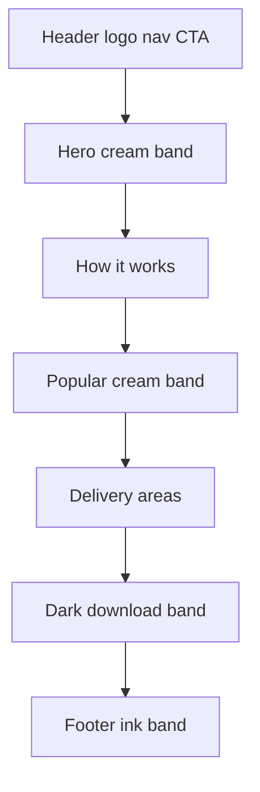

# Chop Chop landing page — implementation plan

Rebuild the Chop Chop marketing page from [design-handoff/style-guide.md](../design-handoff/style-guide.md) and the two comps ([comp-mobile.png](../design-handoff/comp-mobile.png), [comp-desktop.png](../design-handoff/comp-desktop.png)). Then put it on a new public GitHub repo and deploy it to Vercel.

This folder starts with the handoff only: no Vite app, no git, no remotes.

## Checklist

- [ ] Scaffold Vite + Tailwind v4, copy assets to `public/`, write the 15-colour `@theme` block and system font
- [ ] Implement header and cream hero (eyebrow, h1, CTAs, `phone.svg`, stat card) with `sm` / `lg` breakpoints
- [ ] Implement How it works, Popular cards (dishes 1–6), and Areas list to the spacing spec
- [ ] Implement ink download band and footer with on-dark tokens and `chop-light` hovers
- [ ] Apply the five hover motions, focus-visible rings, and asset `alt` rules; verify in the browser at phone, `sm`, and `lg`
- [ ] Init git, add a Vite/Node gitignore, create public GitHub repo `chop-chop-restaurant-website`, and push `main`
- [ ] Connect the GitHub repo to Vercel (Vite / `dist`), deploy production, and confirm the live URL

## Design concept

Chop Chop is a fictional food-delivery app for the Kombos. The page is a single landing surface, not an ordering app. It sells trust in local kitchens (benachin, domoda, yassa, afra) and a short path to the phone app.

Visual system:

- Warm cream bands (`cream`) and white cards (`surface`) on a stone ink palette. Orange (`chop`) is the only accent.
- Three oranges are not interchangeable: `chop` for button fills, `chop-dark` for orange text on cream/white, `chop-light` for orange text on ink.
- No shadows. Motion is small lifts and one sliding arrow. System font stack only. Headings are `font-semibold` + `tracking-tight`, never `font-bold`.
- Mobile-first: unprefixed classes are the phone. `sm:` (40rem) turns header, steps, and footer into rows and grids to two columns. `lg:` (64rem) splits the hero and grids to three columns.



## Stack

Match the handoff method: **Vite + Tailwind CSS v4 + one HTML file**. Colours live only in `@theme`; markup uses named utilities (`bg-chop`, `text-ink-3`). No React, no extra CSS files of hex values.

Scaffold in the project root:

- `package.json` — `vite`, `tailwindcss`, `@tailwindcss/vite`
- `vite.config.js` — `@tailwindcss/vite` plugin
- `src/style.css` — `@import "tailwindcss"` plus the `@theme` block
- `src/main.js` — import the stylesheet
- `index.html` — full page
- `public/` — copy of `design-handoff/assets/` (`logo.svg` also as favicon)
- `.gitignore` — `node_modules`, `dist`, `.env`, `.vercel`

`@theme` starts with `--color-*: initial;` then the fifteen tokens from the guide (`chop`, `chop-dark`, `chop-light`, `chop-soft`, `ink`, `ink-2`, `ink-3`, `surface`, `cream`, `line`, `leaf`, `leaf-soft`, `on-dark`, `on-dark-soft`, `dark-line`) and `--font-sans` as the system stack.

## Page sections

Every section inner wrapper is `max-w-6xl mx-auto px-5`. Default vertical padding is `py-20`; hero is `py-16 lg:py-24`. Shared heading pattern: `text-3xl font-semibold tracking-tight text-ink`, lede `text-lg text-ink-2 max-w-prose mt-3`, content `mt-12` (`mt-10` for areas).

**Header** — `py-4`, stacked then `sm:flex` row with `gap-4`. Logo (`logo.svg`, `alt=""`) + wordmark `text-lg font-semibold`. Nav: How it works, Popular, Areas (`text-sm`, `gap-x-6 gap-y-2`). Hover: `chop` underline (`border-b-2`), text to `ink`, lift `hover:-translate-y-0.5`. CTA `Get the app` is `px-4 py-2` (smaller than section buttons).

**Hero (cream)** — stacked, then `lg:grid` text left / phone right with `lg:gap-16`. Eyebrow `text-sm uppercase tracking-wide text-chop-dark`. `<h1>` `text-4xl lg:text-5xl font-semibold tracking-tight leading-tight`. Buttons `mt-8 gap-5`: primary `bg-chop` (`px-5 py-2.5 rounded-lg`, hover `bg-chop-dark` + lift) and a `group` arrow link (`text-chop-dark`, arrow `group-hover:translate-x-1`). Phone: `phone.svg` at `w-56 lg:w-72 mx-auto` with the real `alt` from the SVG. Stat card absolutely placed (`px-5 py-4 rounded-lg`, `bottom-8 left-0 lg:left-8`) with a `text-2xl` number.

**How it works** — three columns from `sm:`. Icons `step-1.svg` … `step-3.svg` at `h-20 w-20`, `alt=""`. Step number `text-sm font-semibold`, title `text-xl font-semibold`, `gap-10` / `mt-6` / `mt-1` / `mt-2` as specified.

**Popular (cream)** — six cards, `gap-5`, `sm:grid-cols-2 lg:grid-cols-3`. Card: `rounded-xl border border-line p-5`, hover `hover:-translate-y-1 duration-200`. Dish SVGs in order 1–6, `aspect-3/2 w-full object-cover`, `alt=""`. Title `text-lg font-semibold`, kitchen `text-sm text-ink-3`, price row `pt-5`. Vegetarian badge: `text-xs font-semibold rounded-full px-2.5 py-0.5 bg-leaf-soft text-leaf`. Popular badge uses `chop-soft` / `chop-dark`. Add: `px-4 py-2 text-sm rounded-lg border`; hover fills `ink` / `on-dark` and does not lift.

**Areas** — list of Kombos neighbourhoods as `rounded-lg border` rows (`px-5 py-4 gap-4`), `sm:grid-cols-2 lg:grid-cols-3`. Delivery-time captions in `text-ink-3`.

**Download (dark / ink)** — `text-on-dark`, muted `on-dark-soft`, dividers `dark-line`. Accent text `chop-light`. Android-style outline button lifts and border goes `on-dark`. Focus rings on this band use `outline-chop-light`.

**Footer (ink)** — `py-12`, brand + link columns (`gap-10`, then `gap-x-12 gap-y-8`), links `text-sm gap-2`, hover `text-chop-light` with no motion. Copyright rule `mt-10 pt-6 border-t border-dark-line`. Same logo, `alt=""`.

**Focus (all light-band controls):** `focus-visible:outline-2 focus-visible:outline-offset-2 focus-visible:outline-chop`. Transitions: `duration-200` everywhere motion exists.

## Page copy (from the comps)

Type this as it appears on [comp-mobile.png](../design-handoff/comp-mobile.png) and [comp-desktop.png](../design-handoff/comp-desktop.png). Nav and in-page targets: `#how-it-works`, `#popular`, `#areas`, `#get-the-app`. Add buttons stay visual (`type="button"`); this is a landing page, not a cart.

**Header**

- Wordmark: Chop Chop
- Nav: How it works · Popular · Areas
- Button: Get the app

**Hero**

- Eyebrow: FROM THE KOMBOS TO YOUR DOOR
- H1: Dinner in one tap
- Lede: Forty kitchens. Benachin, yassa, afra — what your neighbour already orders. Wave or cash at the gate.
- Primary: Get the app
- Arrow: See this week's dishes
- Stat: 25 min · typical wait

**How it works**

- Heading: Three taps. Then dinner.
- Lede: Open the app, pick a kitchen, and a rider is on the way. No phone call.
- 01 Pick a kitchen — Forty kitchens, from Westfield to Brusubi, with live opening hours and honest delivery times.
- 02 Build your order — Extra pepper, no onions, two spoons. Every kitchen gets your note before it starts cooking.
- 03 Meet your rider — See the scooter on the map from the moment it leaves. Pay cash at the gate or Wave in the app.

**Popular this week**

- Heading: Popular this week
- Lede: What the Kombos ordered most in the last seven days.

| Dish | Kitchen | Price | Badge |
| --- | --- | --- | --- |
| Benachin | Mariama's | D 180 | Popular |
| Domoda | The Groundnut Bowl | D 150 | |
| Yassa chicken | Yassa House | D 200 | |
| Afra | Night Market Grill | D 250 | |
| Super kanja | Okra & Palm | D 140 | Vegetarian |
| Tapalapa & eggs | Street Bakery | D 80 | |

**Areas**

- Heading: We deliver, Monday to Sunday.
- Lede: Typical time from the kitchen to your gate. Later at lunch, earlier if you are next door.

| Area | Time |
| --- | --- |
| Kololi | 20–30 min |
| Kotu | 25–35 min |
| Senegambia | 20–30 min |
| Brusubi | 35–45 min |
| Bakau | 30–40 min |
| Bijilo | 25–35 min |

**Download**

- Heading: Get Chop Chop on your phone
- Lede: Free to install. Your first delivery is on us, anywhere from Bakau to Brusubi.
- Buttons: iPhone · Android (desktop: Download for iPhone · Download for Android)

**Footer**

- Brand line: Hot food from the Kombos, at your door.
- Columns: How it works / Popular / Areas · About / Kitchens / Help
- Copyright: © 2026 Chop Chop. Built for the Kombos.

## Implementation order

Build top to bottom so each session-sized chunk can be checked at 375px, `sm`, and `lg` before the next:

1. Scaffold Vite/Tailwind and lock the `@theme` tokens (include a Node/Vite `.gitignore`).
2. Header + hero (hardest layout: cream band, phone, stat card).
3. Steps, then Popular cards, then areas list.
4. Dark download band + footer.
5. Hover, focus-visible, and asset `alt` rules; browser-check the full page.
6. Create the GitHub repo and push `main`.
7. Deploy that repo to Vercel and confirm the production URL.

## GitHub

This folder is **not a git repo yet**. `gh` is not on PATH. After the page is built and checked locally:

- `git init` here (not in a parent course folder).
- Add a standard Vite `.gitignore` (`node_modules`, `dist`, `.env`, `.vercel`).
- Install GitHub CLI if needed (`winget install GitHub.cli` or equivalent) and authenticate (`gh auth login`).
- Create a **new public** repo named `chop-chop-restaurant-website` and push `main`:

```bash
gh repo create chop-chop-restaurant-website --public --source=. --remote=origin --push
```

Do not commit secrets. `design-handoff/` stays in the repo so the tokens and assets remain the source of truth.

## Vercel

`vercel` is not on PATH either. After GitHub is live:

- Install Vercel CLI (`npm i -g vercel`) and log in.
- Import the GitHub repo (CLI `vercel --prod` linked to the git remote, or the Vercel dashboard Import).
- Vite settings Vercel should detect: **Build** `npm run build`, **Output** `dist`, framework **Vite**. No env vars.
- Confirm production URL loads the landing page (assets, nav jumps, hover states).
- Leave the GitHub connection in place so later pushes to `main` redeploy automatically.

## Verification

Open the Vite app in the browser and walk the page as a user: nav jumps, both hero CTAs, card hover, Add hover (fill, no lift), arrow slide, footer links. Check stacked vs `sm` row vs `lg` three-column layouts against the two comps. Confirm no default Tailwind palette classes (`bg-red-500` and similar) and no hex in HTML.

Then confirm the GitHub repo URL and the Vercel production URL both serve the same built page.
